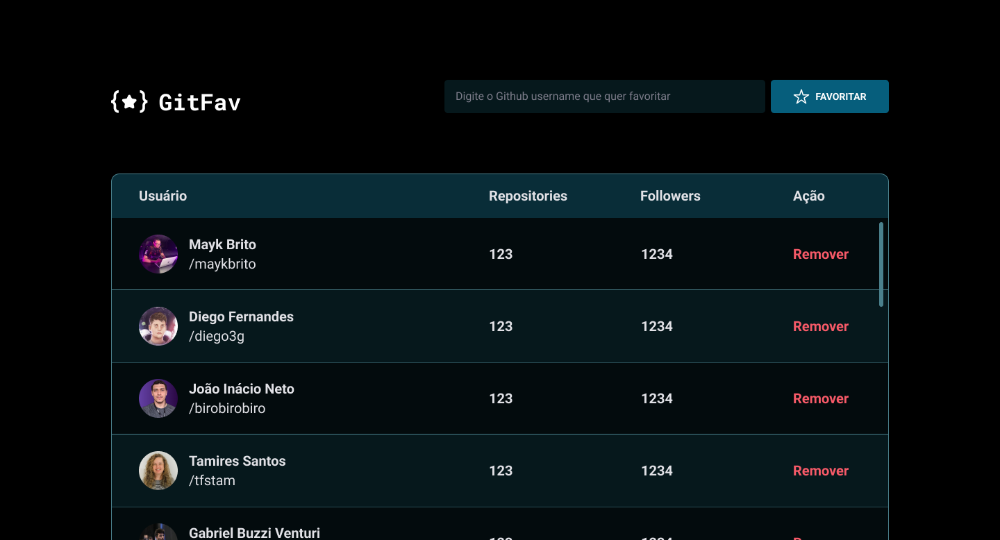

<h1 align="center"> Github favourites </h1>

  <a href="#-technologies">Technologies</a>&nbsp;&nbsp;&nbsp;|&nbsp;&nbsp;&nbsp;
  <a href="#-project">Project</a>&nbsp;&nbsp;&nbsp;|&nbsp;&nbsp;&nbsp;
  <a href="#-layout">Layout</a>&nbsp;&nbsp;&nbsp;|&nbsp;&nbsp;&nbsp;
  <a href="#memo-license">License</a>

  

 

  

## 🚀 Technologies

This project was developed with the following technologies:

- HTML e CSS
- JavaScript
- Git e Github

## 💻 Project

An application that allows the users to add or remove their favourites Github profiles and see informations about the profile added.

## 🔖 Layout

You can view the layout of the project through [THIS LINK](https://www.figma.com/file/F4FETpCil2DgjzMiUlNqJn/%5BDesafios-Explorer%5D-GitFav-(Copy)-(Copy)?node-id=301-324&t=0yuNsJoRMCr9j8Ms-0). It is necessary to have an account on [Figma](https://figma.com) to access it.

## :memo: License

This project is licensed under MIT.

---

Made with ♥ by Lucas for a Rocketseat course task :wave: